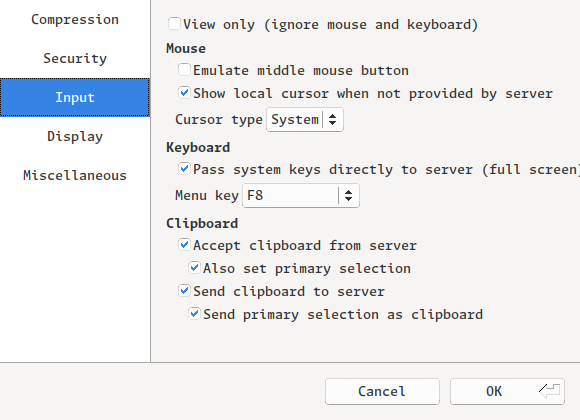

## Get source code

According [Getting Started Page](https://www.chromium.org/chromium-os/developer-library/getting-started/) in chromium document.
Download the depot_tools, skip the "Setup your development Chromebook" section, follow the instruction of "Checkout Chromium" section...

Because my partation use btrfs filesystem with compression turned on.
But according [ChromiumOS Developer Guide#compatible-filesystems](https://www.chromium.org/chromium-os/developer-library/guides/development/developer-guide/#compatible-filesystems), btrfs with compression may have some compatibility issue.
So I have to insert another SATA hard disk, format it with ext4, and mount it to `/mnt/ext`.

My workspace is set to `/mnt/ext/chromium`.

## Checkout depot_tools

I create a alias `cc-env` to initial the environment of depot_tools toolchain.

```sh
git clone https://chromium.googlesource.com/chromium/tools/depot_tools.git
echo "alias cc-env='PATH=/mnt/ext/chromium/depot_tools:\$PATH';BOARD=amd64-generic" >> ~/.zshrc
source ~/.zshrc
```

## Checkout Chromium OS

```sh
~$ mkdir /mnt/ext/chromium/chromiumos
~$ ln -s /mnt/ext/chromium/chromiumos ~/chromiumos
~$ cd ~/chromiumos
chromiumos$ repo init -u https://chromium.googlesource.com/chromiumos/manifest -b release-R118-15604.B
chromiumos$ repo sync -j16
```

For reference, I also fetch the chromium source code.

```sh
~$ mkdir /mnt/ext/chromium/chromium
~$ ln -s /mnt/ext/chromium/chromium ~/chromium
~$ cd ~/chromium
chromium$ cc-env
chromium$ fetch --nohooks chromium
```

It's so slow, after doing some search, I add the `--no-history` option on `fetch command`.
It still take a will before it get enough infomation to use the `gclient sync` command.

```sh
~$ mkdir /mnt/ext/chromium/chromium
~$ ln -s /mnt/ext/chromium/chromium ~/chromium
~$ cd ~/chromium
chromium$ cc-env
chromium$ fetch --nohooks --no-history chromium
chromium$ gclient sync --nohooks
```

## Google Cloud Authorization

While code is fetching, I follow [document for API keys](https://www.chromium.org/developers/how-tos/api-keys), create the API key.

According the document, next step is to get access to Google Storage buckets.
For `gsutil` to work properly, install the `google-cloud-cli` aur package and execute the follwing command:

```sh
~$ gcloud auth login
~$ ls -s /home/mao/.config/gcloud/legacy_credentials/*/.boto ~/.boto
```

## Build Chromium OS

At first, I try to build packages directly with the following command:

```sh
chromiumos$ cc-env

chromiumos$ cros build-image --board=${BOARD}
```

Then the python throw a error:

```log
ModuleNotFoundError: No module named 'chromite.third_party.six.moves'
```

I try to use `which vpython3`, view the `third_party` directory, not found the cause of this problem.
So I do some try until realized that the problem is python3 version.
Check the version of python3:

```log
chromiumos$ cros_sdk
(cr) (release-R118-15604.B/(f64035d5...)) mao@pc-mao ~/chromiumos/src/scripts $ vpython3 -V
Python 3.8.10+chromium.25
```

Use the same version on host:

```sh
~$ pyenv install 3.8.10
```

Retry build:

```sh
chromiumos$ cc-env
# using python 3.11
chromiumos$ pyenv local 3.11

chromiumos$ cros build-image --board=${BOARD}
```

Stuck on `chrome-icu` package:

```logs
>>> 22:40:05.527 Emerging (1 of 24) chromeos-base/chrome-icu-118.0.5993.164_rc-r1::chromiumos for /build/amd64-generic/
>>> 22:42:51.050 Jobs: 0 of 24 complete, 1 running               Load avg: 0.24, 0.49, 0.70
```

```sh
01:16:45.325 INFO    cros_sdk:make_chroot: Elapsed time (make_chroot.sh): 9m49s
01:16:45.325: INFO: cros_sdk_lib.ChrootCreator._make_chroot: 9m48.632s
01:16:45.326: INFO:
All set up.  To enter the chroot, run:
$ cros_sdk --enter

CAUTION: Do *NOT* rm -rf the chroot directory; if there are stale bind mounts
you may end up deleting your source tree too.  To unmount & delete cleanly, use:
$ cros_sdk --delete

01:16:45.326: INFO: cros_sdk_lib.ChrootCreator.run: 10m30.435s
01:16:45.326: INFO: cros_sdk_lib.CreateChroot: 10m30.435s
01:16:45: WARNING: Unable to clear shadow-utils lockfiles, path does not exist: /build/amd64-generic/etc
01:16:45: ERROR: cros build-image failed before completing.
01:16:45: ERROR: return code: None; command: portageq-amd64-generic envvar -v USE
[Errno 2] No such file or directory: 'portageq-amd64-generic'
01:16:45: ERROR: (Re-run with --debug for more details.)
```

Accorfing the output, in previous try, I just `rm` the chroot dir, which cause the problem.

```sh
chromiumos$ cros_sdk --delete

chromiumos$ repo sync -j16

chromiumos$ cros build-packages --board=${BOARD}
```

It take a night.

Too build disk image:

```sh
chromiumos$ rm -rf src/build/images/${BOARD}/* # remove old builds

chromiumos$ cros build-image --board=${BOARD} --no-enable-rootfs-verification dev
```

```sh
chromiumos$ lt -L 2 src/build/images/amd64-generic
drwxr-xr-x    - mao 12 May 07:11  src/build/images/amd64-generic
lrwxrwxrwx    - mao 12 May 07:11 ├──  latest -> R118-15604.74.0-d2025_05_12_071120-a1
drwxrwxr-x    - mao 12 May 07:15 └──  R118-15604.74.0-d2025_05_12_071120-a1
.rw-r--r--  425 mao 12 May 07:15     ├──  boot.config
.rw-r--r--  213 mao 12 May 07:13     ├──  boot.desc
drwxr-xr-x    - mao 12 May 07:13     ├──  boot_images
.rw-r--r--  32k mao 12 May 07:13     ├──  chromiumos_base_image.bin-package-sizes.json
.rw-r--r--  11G mao 12 May 07:15     ├──  chromiumos_image.bin
.rw-r--r--  539 mao 12 May 07:15     ├──  config.txt
drwxrwxr-x    - mao 12 May 07:15     ├──  dlc
drwxr-xr-x    - mao 12 May 07:14     ├──  esp
.rw-r--r-- 612k mao 12 May 07:13     ├──  license_credits.html
.rwxr-xr-x 6.2k mao 12 May 07:11     ├──  mount_image.sh
.rwxr-xr-x 6.9k mao 12 May 07:11     ├──  pack_partitions.sh
.rw-r--r--  17k mao 12 May 07:11     ├──  partition_script.sh
.rw-r--r-- 8.3k mao 12 May 07:11     ├──  partition_vars.json
.rwxr-xr-x  808 mao 12 May 07:11     ├──  umount_image.sh
.rwxr-xr-x 7.1k mao 12 May 07:11     ├──  unpack_partitions.sh
.rw-r--r--  11M mao 12 May 07:15     └──  vmlinuz.bin
```

## Run the Image

Run the image with `cros vm` commnad. The `--qemu-cpu host` option make sure that qemu-x86_64 recognize the cpu feature correctly.

```sh
cros vm --start --image-path=~/chromiumos/src/build/images/amd64-generic/latest/chromiumos_image.bin --board=amd64-generic --debug --qemu-cpu host
```

Connect to vm using vnc:

```sh
vncviewer localhost:5900
```


### A SSH error

The vnc show, but the `cros vm` command exit soon with errors followed:

```log
07:39:39.742: INFO: run: ssh -p 9222 '-oConnectTimeout=30' '-oConnectionAttempts=4' '-oNumberOfPasswordPrompts=0' '-oProtocol=2' '-oServerAliveInterval=15' '-oServerAliveCountMax=8' '-oStrictHostKeyChecking=no' '-oUserKnownHostsFile=/dev/null' '-oIdentitiesOnly=yes' -i /tmp/ssh-tmpjeuheec0/testing_rsa root@localhost -- true
07:39:39.849: INFO: (stdout):
Warning: Permanently added '[localhost]:9222' (ED25519) to the list of known hosts.
root@localhost: Permission denied (publickey,keyboard-interactive).

07:39:39.849: ERROR: Error connecting to device localhost
07:39:39.849: DEBUG: <class 'chromite.lib.remote_access.SSHConnectionError'>(None)
07:39:39.849: ERROR: cros vm failed before completing.
cros: Unhandled exception:
Traceback (most recent call last):
  File "/mnt/ext/chromium/chromiumos/chromite/lib/remote_access.py", line 474, in RemoteSh
    return cros_build_lib.run(ssh_cmd, **kwargs)
  File "/mnt/ext/chromium/chromiumos/chromite/lib/cros_build_lib.py", line 952, in run
    raise RunCommandError(msg, cmd_result)
chromite.lib.cros_build_lib.RunCommandError: return code: 255; command: ssh -p 9222 '-oConnectTimeout=30' '-oConnectionAttempts=4' '-oNumberOfPasswordPrompts=0' '-oProtocol=2' '-oServerAliveInterval=15' '-oServerAliveCountMax=8' '-oStrictHostKeyChecking=no' '-oUserKnownHostsFile=/dev/null' '-oIdentitiesOnly=yes' -i /tmp/ssh-tmpjeuheec0/testing_rsa root@localhost -- true
Warning: Permanently added '[localhost]:9222' (ED25519) to the list of known hosts.
root@localhost: Permission denied (publickey,keyboard-interactive).

cmd=['ssh', '-p', '9222', '-oConnectTimeout=30', '-oConnectionAttempts=4', '-oNumberOfPasswordPrompts=0', '-oProtocol=2', '-oServerAliveInterval=15', '-oServerAliveCountMax=8', '-oStrictHostKeyChecking=no', '-oUserKnownHostsFile=/dev/null', '-oIdentitiesOnly=yes', '-i', '/tmp/ssh-tmpjeuheec0/testing_rsa', 'root@localhost', '--', 'true'], extra env={'LC_MESSAGES': 'C'}

During handling of the above exception, another exception occurred:

Traceback (most recent call last):
  File "/mnt/ext/chromium/chromiumos/chromite/lib/device.py", line 68, in WaitForBoot
    result = retry_util.RetryException(
  File "/mnt/ext/chromium/chromiumos/chromite/lib/retry_util.py", line 334, in RetryException
    return _run()
  File "/mnt/ext/chromium/chromiumos/chromite/lib/retry_util.py", line 262, in _Wrapper
    raise exc_info[1].with_traceback(exc_info[2])
  File "/mnt/ext/chromium/chromiumos/chromite/lib/retry_util.py", line 214, in _Wrapper
    ret = func(*args, **kwargs)
  File "/mnt/ext/chromium/chromiumos/chromite/lib/retry_util.py", line 332, in _run
    return functor(*args, **kwargs)
  File "/mnt/ext/chromium/chromiumos/chromite/lib/device.py", line 71, in <lambda>
    functor=lambda: self.run(cmd=["true"]),
  File "/mnt/ext/chromium/chromiumos/chromite/lib/device.py", line 102, in run
    return self.remote.run(
  File "/mnt/ext/chromium/chromiumos/chromite/lib/remote_access.py", line 1740, in run
    return super().run(cmd, **kwargs)
  File "/mnt/ext/chromium/chromiumos/chromite/lib/remote_access.py", line 1471, in run
    return self.agent.RemoteSh(cmd, **kwargs)
  File "/mnt/ext/chromium/chromiumos/chromite/lib/remote_access.py", line 481, in RemoteSh
    raise SSHConnectionError(e.stderr)
chromite.lib.remote_access.SSHConnectionError: None
```

It seems that the public key `/tmp/ssh-tmpn3ke_wxv/testing_rsa` is not valid:

```sh
chromiumos$ cat chroot/build/amd64-generic/usr/share/chromeos-ssh-config/keys/authorized_keys
ssh-rsa AAAAB3NzaC1yc2EAAAABIwAAAQEAvsNpFdK5lb0GfKx+FgsrsM/2+aZVFYXHMPdvGtTz63ciRhq0Jnw7nln1SOcHraSz3/imECBg8NHIKV6rA+B9zbf7pZXEv20x5Ul0vrcPqYWC44PTtgsgvi8s0KZUZN93YlcjZ+Q7BjQ/tuwGSaLWLqJ7hnHALMJ3dbEM9fKBHQBCrG5HOaWD2gtXj7jp04M/WUnDDdemq/KMg6E9jcrJOiQ39IuTpas4hLQzVkKAKSrpl6MY2etHyoNarlWhcOwitArEDwf3WgnctwKstI/MTKB5BTpO2WXUNUv4kXzA+g8/l1aljIG13vtd9A/IV3KFVx/sLkkjuZ7z2rQXyNKuJw== ChromeOS test key

chromiumos$ cat chromite/ssh_keys/testing_rsa.pub
ssh-rsa AAAAB3NzaC1yc2EAAAABIwAAAQEAvsNpFdK5lb0GfKx+FgsrsM/2+aZVFYXHMPdvGtTz63ciRhq0Jnw7nln1SOcHraSz3/imECBg8NHIKV6rA+B9zbf7pZXEv20x5Ul0vrcPqYWC44PTtgsgvi8s0KZUZN93YlcjZ+Q7BjQ/tuwGSaLWLqJ7hnHALMJ3dbEM9fKBHQBCrG5HOaWD2gtXj7jp04M/WUnDDdemq/KMg6E9jcrJOiQ39IuTpas4hLQzVkKAKSrpl6MY2etHyoNarlWhcOwitArEDwf3WgnctwKstI/MTKB5BTpO2WXUNUv4kXzA+g8/l1aljIG13vtd9A/IV3KFVx/sLkkjuZ7z2rQXyNKuJw== ChromeOS test key
```

Can't locate the problem, so I end up switch to `test` image build to get it work:

```sh
# swith to test
chromiumos$ cros build-image --board=${BOARD} --no-enable-rootfs-verification test

chromiumos$ cros vm --start --image-path=~/chromiumos/src/build/images/${BOARD}/latest/chromiumos_test_image.bin --board=${BOARD} --debug --qemu-cpu host
```

### Fix mouse cursor missing

Press F8, open TigerVNC setting, enable local cursor.



### Login process stuck on "Please wait..." - Fix API Key not found

As screenshot shows, the API key is invalid. I have a wrong format of `.googleapikeys`, change it and rebuild chrome:

```sh
chromiumos$ cros_sdk -- emerge-$BOARD chromeos-chrome
# rebuild image
chromiumos$ cros build-image --board=${BOARD} --no-enable-rootfs-verification test
```

Still not work, maybe `cros workon` will help.

```
chromiumos$ cros workon --board=${BOARD} start chromeos-base/chromeos-chrome
chromiumos$ cros_sdk equery-${BOARD} which chromeos-chrome
/mnt/host/source/src/third_party/chromiumos-overlay/chromeos-base/chromeos-chrome/chromeos-chrome-9999.ebuild
```

ref:
- [Groups conversation](https://groups.google.com/a/chromium.org/g/chromium-os-dev/c/ulzNpx50SgY)
- [Chrome API keys documentation](https://www.chromium.org/chromium-os/developer-library/guides/development/chrome-api-keys-in-the-chroot/)

## Build ChromiumOS

```sh
# using python 3.11
chromium$ pyenv local 3.11
```

Config `~/chromium/.gclient` file:

```python
solutions = [
  {
    "name": "src",
    "url": "https://chromium.googlesource.com/chromium/src.git",
    "managed": False,
    "custom_deps": {},
    "custom_vars": {
    	#"cros_boards": "amd64-generic",
        "cros_boards_with_qemu_images": "amd64-generic",
    },
  },
]
target_os = ['chromeos']
```

```sh
# re-sync
chromium$ gclient sync --jobs=16 # without `--nohooks`
# merge the config
chromium/src$ gn gen out_${SDK_BOARD}/Release --args="
    import(\"//build/args/chromeos/${SDK_BOARD}.gni\")
    is_chrome_branded = false
    is_official_build = false
    optimize_webui = false
    target_os = \"chromeos\"
    use_remoteexec = false"
# generate args.gn
chromium/src$ gn args out_${SDK_BOARD}/Release
# build chromium
chromium$ autoninja -C out_${SDK_BOARD}/Release chrome
```
